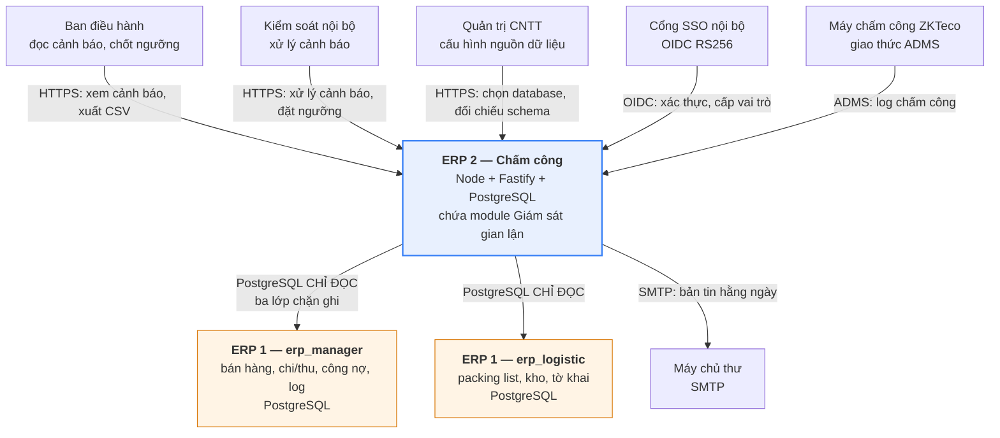

# C4 mức 1 — Bối cảnh: module Giám sát gian lận

Sơ đồ đặt module trong bối cảnh các hệ thống và con người quanh nó. Người không làm kỹ thuật
đọc được sơ đồ này.

**Chú giải:** khối xanh là hệ thống ta xây; khối cam là hệ thống của đội khác — ta chỉ **đọc**,
không bao giờ ghi.

## Vì sao mũi tên chỉ một chiều tới ERP 1

Module không có đường ghi nào sang ERP 1. Ba lớp chặn (quyền tài khoản, tham số chuỗi kết nối,
`begin read only` mỗi truy vấn) và một bài kiểm kiến trúc trong CI cưỡng chế điều đó.

Hệ quả cần biết: **ERP 1 không biết module này tồn tại.** Nếu ERP 1 đổi tên bảng, module im
lặng trả 0 dòng. Lệnh `doi_chieu_schema` là thứ duy nhất biến sự im lặng đó thành báo cáo.
