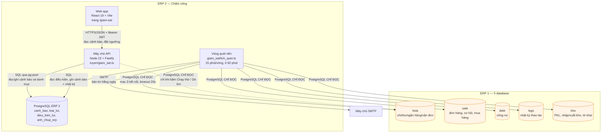

# C4 mức 2 — Container: module Giám sát gian lận

Mỗi mũi tên ghi rõ **giao thức** và **mục đích** — không viết chung chung "gọi API".

## Vì sao tách vòng quét khỏi luồng request

Đọc CSDL của hệ thống khác là việc chậm và không đoán trước được. Đặt nó trong luồng xử lý
request thì một truy vấn treo bên ERP 1 sẽ làm treo một request của người dùng đang chờ màn
hình chấm công.

Ngoại lệ duy nhất là nút **Chạy thử** và **Dò tìm database**: người dùng chủ động bấm và
đang đứng chờ kết quả, nên chạy đồng bộ là đúng.

## Khóa việc

Nhiều instance chạy song song không quét trùng: mỗi loại lỗi × mỗi ô thời gian là một dòng
`cong_viec_da_chay`, giành bằng `insert ... on conflict do nothing` (nguyên tử).

## Sơ đồ này khớp thực tế

Kiểm chứng ngày 02.09.2026: 31 migration chạy sạch trên PostgreSQL 16, API trả đúng phân
quyền qua `app.inject()`, 16 bài e2e xanh.
