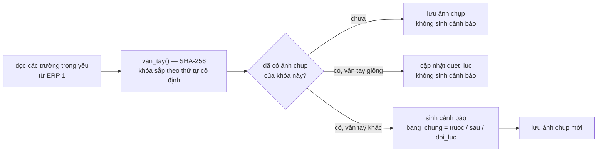

# Luồng dữ liệu một cảnh báo — từ lúc quét đến lúc đóng

Tài liệu này tồn tại để **lần vết được khi có tranh chấp** (mục F1.3). Khi một người bị nêu
tên trong cảnh báo hỏi *"con số này ở đâu ra"*, câu trả lời phải tra được từ đây, không phải
từ trí nhớ của người viết code.

---

## 1. Toàn cảnh

```mermaid
sequenceDiagram
    autonumber
    participant L as lich_quet.ts
    participant DB as CSDL ERP 2
    participant D as danh_gia.ts
    participant P as phep_do/*.ts
    participant E as ERP 1 (chỉ đọc)
    participant N as ban_tin.ts
    participant U as Người kiểm soát

    L->>DB: nhận việc (insert on conflict do nothing)
    Note over L,DB: một instance thắng, các instance khác bỏ qua ô này
    L->>D: cac_loi_can_quet()
    D->>DB: đọc loai_loi BẬT + dieu_kien_loi BẬT
    loop mỗi loại lỗi
        D->>P: do(ngu_canh, tham_so)
        P->>E: begin read only; select … $1,$2; commit
        E-->>P: các dòng đo
        P-->>D: DongDo[] (gia_tri, bang_chung, …)
        D->>D: thoa_man(gia_tri, toan_tu, nguong) — AND các điều kiện
        D->>DB: insert canh_bao … on conflict do nothing
        D->>DB: insert lan_quet_giam_sat (đọc bao nhiêu, mới bao nhiêu, mili giây)
    end
    L->>N: đến giờ gửi bản tin?
    N->>DB: canh_bao trạng thái 'moi' trong 24 giờ
    N-->>U: email — "dấu hiệu cần kiểm tra"
    U->>DB: đổi trạng thái + ghi canh_bao_xu_ly
```

---

## 2. Từng chặng, và cái gì được ghi lại

### Chặng 1 — Nhận việc

`lich_quet.ts` chạy mỗi 15 phút. Mỗi loại lỗi được quét tối đa **một lần trong ô 60 phút**.

Khóa việc: `insert into cong_viec_da_chay(ma_viec) values ('quet_giam_sat:<mã lỗi>:<ô>')
on conflict do nothing`. Câu này nguyên tử, nên nhiều instance chạy song song thì đúng một
instance quét — không đọc trùng CSDL ERP 1.

**Vết để lại:** một dòng `cong_viec_da_chay` kèm cột `ket_qua` ghi số bản ghi đọc, số cảnh báo
mới và thời gian chạy. Giữ 7 ngày.

### Chặng 2 — Chọn việc phải quét

`danh_gia.ts` → `cac_loi_can_quet()` lấy các `loai_loi` **đang bật** có ít nhất một
`dieu_kien_loi` **đang bật**. Lỗi tắt, điều kiện tắt: bỏ qua hoàn toàn, không đọc ERP 1.

Đây là điểm chặn quan trọng nhất về mặt vận hành: hệ thống mới cài **không có điều kiện nào
bật**, nên nó đọc ERP 1 nhưng không sinh cảnh báo nào cho đến khi có người bật từng cái một.

### Chặng 3 — Đọc dữ liệu ERP 1

Phép đo nhận `ngu_canh` (gồm `doc` cho ERP 1, `doc_noi_bo` cho ERP 2, và mốc thời gian) rồi
gọi `ctx.doc(nguon, sql, tham_so)`.

Mỗi truy vấn đi qua **ba lớp chặn ghi**:

| Lớp | Ở đâu | Chặn cái gì |
|---|---|---|
| Quyền Postgres | ERP 1 | `GRANT SELECT` + `default_transaction_read_only = on` trên vai trò |
| Chuỗi kết nối | `ket_noi_erp.ts` | `options=-c default_transaction_read_only=on` |
| Mỗi truy vấn | `ket_noi_erp.ts` | `begin read only` … `commit` |

Chỉ `giam_sat/ket_noi_erp.ts` được mở kết nối sang ERP 1 — có bài kiểm trong CI cưỡng chế điều
này, vì một tệp khác tự tạo pool là đi vòng qua cả ba lớp.

Tham số **luôn** qua `$1,$2`, không nối chuỗi — cũng có bài kiểm trong CI.

**Vết để lại:** `lan_quet_giam_sat` ghi số bản ghi đọc và `mili_giay`. Nhật ký **không** ghi
nội dung bản ghi ERP 1 (B6.8 — log không được rò dữ liệu).

Phép đo cần dữ liệu từ hai database (ví dụ đơn hàng ở `sale` + packing list ở `kho`) chạy hai
truy vấn rồi ghép trong Node: Postgres không join chéo database, và `postgres_fdw`/`dblink`
đòi quyền vượt mức chỉ đọc.

### Chặng 4 — So ngưỡng

Mỗi dòng đo trả về `gia_tri`. `thoa_man(gia_tri, toan_tu, nguong)` — hàm dùng chung với module
Vi phạm nội quy, đã có test — quyết định dòng đó có khớp không.

Nhiều điều kiện của cùng một lỗi nối bằng **AND**: dòng phải khớp tất cả. Cần OR thì tạo hai
loại lỗi.

Hai quy tắc phòng thủ, cả hai nghiêng về **thà bỏ sót còn hơn bắt oan**:

- Toán tử lạ ⇒ **không khớp**.
- Phép đo không có trong `chi_muc.ts` ⇒ bỏ qua và ghi nhật ký, không làm sập vòng quét.

### Chặng 5 — Ghi cảnh báo

```sql
insert into canh_bao (…) values (…) on conflict do nothing
```

Khóa chống trùng:

```sql
unique (loai_loi_id, nguon_ma, thuc_the, thuc_the_khoa, coalesce(ky, ''))
```

Hệ quả hai chiều, cả hai đều cố ý:

- Quét lại nhiều lần **không** sinh bản ghi trùng.
- Kết luận người xử lý đã viết **không bị ghi đè** ở vòng quét sau.

Trạng thái ghi vào luôn là `moi`. **Máy không bao giờ đặt trạng thái nào khác.**

Nội dung `bang_chung` chỉ gồm **các trường cần để đối chiếu**, không sao chép nguyên bản ghi
ERP 1 — giảm bề mặt rò rỉ, và ERP 1 vẫn là nguồn gốc duy nhất của dữ liệu đó.

### Chặng 5b — Nhánh phát hiện sửa lén

Nhiều bảng tiền của ERP 1 không có `ModifiedDate`/`ModifiedBy`, nên việc sửa số tiền sau khi
duyệt **không để lại dấu vết** để truy vấn. Các phép đo nhóm này đi thêm một nhánh:



**Giới hạn phải nói thẳng:** vân tay cho biết **cái gì đổi và khi nào**, **không** cho biết
**ai đổi**. ERP 1 không lưu thông tin đó. Bổ sung được một phần bằng đối chiếu
`logs."EmployeeActionLog"` khi bảng đó có ghi nhận. Xem
`tai_lieu/adr/0004-van-tay-phat-hien-sua-len.md`.

### Chặng 6 — Báo ra ngoài

Ba kênh, cùng một nguồn dữ liệu:

| Kênh | Nội dung | Ràng buộc |
|---|---|---|
| Màn hình `/giam-sat` | Đầy đủ, gồm `bang_chung` | Đăng nhập + vai trò `admin`/`kiem_soat`; ngoài phạm vi trả **404** |
| Bản tin email | Mỏng: mức độ, nhóm, tiêu đề, số tiền, người liên quan, một liên kết | HTML thoát ký tự — tiêu đề chứa dữ liệu do người ngoài gõ được. **Không** đưa bằng chứng chi tiết vào email |
| Xuất CSV | Như màn hình, theo bộ lọc đang áp | BOM UTF-8; ô bắt đầu bằng `= + - @` bị vô hiệu hóa |

Email cố ý mỏng vì nó đi qua máy chủ thư của bên thứ ba, nằm trong hộp thư cá nhân, và được
chuyển tiếp dễ hơn nhiều so với một màn hình có đăng nhập. Ai cần chi tiết thì bấm vào hệ
thống, nơi có phân quyền thật.

### Chặng 7 — Xử lý và đóng

```
moi ──► dang_kiem_tra ──► xac_nhan ──► da_xu_ly
                      └─► bo_qua   ──► da_xu_ly
```

Mỗi lần đổi trạng thái ghi một dòng `canh_bao_xu_ly`: ai, lúc nào, từ trạng thái nào sang
trạng thái nào, ghi chú. **Không sửa, không xóa được qua API** — đó là hồ sơ kiểm soát nội bộ.

Cảnh báo đã đóng tự rụng sau 365 ngày kể từ `xu_ly_luc`. Cảnh báo **chưa** xử lý không bao giờ
bị dọn.

---

## 3. Trả lời một tranh chấp — theo thứ tự

Khi có người phản đối một cảnh báo, tra theo thứ tự này, mỗi bước đều có dữ liệu lưu lại:

| Câu hỏi | Tra ở đâu |
|---|---|
| Cảnh báo này do quy tắc nào sinh? | `canh_bao.loai_loi_id` → `loai_loi` → `dieu_kien_loi` |
| Ngưỡng lúc đó là bao nhiêu? | `canh_bao.nguong` — **chụp lại tại thời điểm sinh**, nên đổi ngưỡng sau này không làm sai lệch cảnh báo cũ |
| Giá trị đo được là bao nhiêu, dựa trên số liệu nào? | `canh_bao.gia_tri` và `canh_bao.bang_chung` |
| Bản ghi gốc ở ERP 1 là cái nào? | `canh_bao.nguon_ma` + `thuc_the` + `thuc_the_khoa` |
| Quét lúc nào, đọc bao nhiêu bản ghi? | `lan_quet_giam_sat` cùng `loai_loi_id`, quanh `phat_hien_luc` |
| Ai đã đụng vào cảnh báo này? | `canh_bao_xu_ly` |
| Câu SQL đã chạy là gì? | Mã nguồn `giam_sat/phep_do/*.ts` — SQL nằm trong code, có lịch sử git, không ai sửa được qua giao diện |

Dòng cuối là lý do SQL cố ý **không** để trong CSDL: một câu truy vấn sửa được qua màn hình là
một câu truy vấn không lần vết được về sau. Xem `tai_lieu/adr/0003-sql-trong-code.md`.

---

## 4. Dữ liệu module này **không** giữ

Ghi ra để không ai đi tìm nhầm chỗ:

- **Không** sao chép dữ liệu chủ của ERP 1 (khách hàng, đơn hàng, chứng từ). Chỉ giữ khóa và
  bằng chứng tối thiểu; ERP 1 vẫn là nguồn gốc duy nhất.
- **Không** ghi bất cứ thứ gì sang ERP 1.
- **Không** lưu thông tin đăng nhập ERP 1 trong CSDL — chỉ ở `.env` của máy chủ.
- **Không** ghi nội dung bản ghi ERP 1 vào nhật ký ứng dụng.
